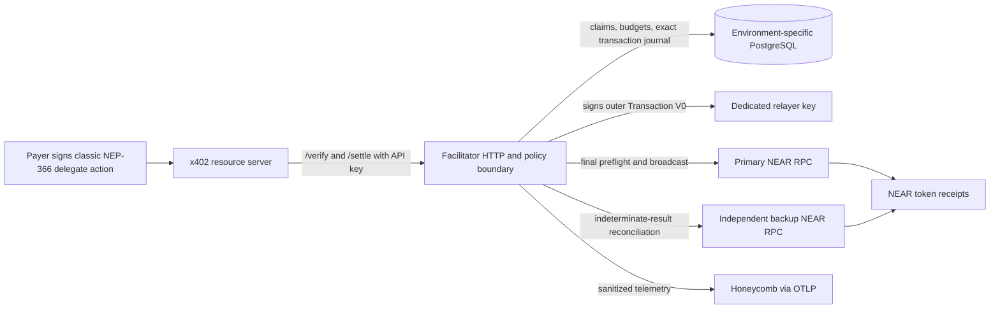
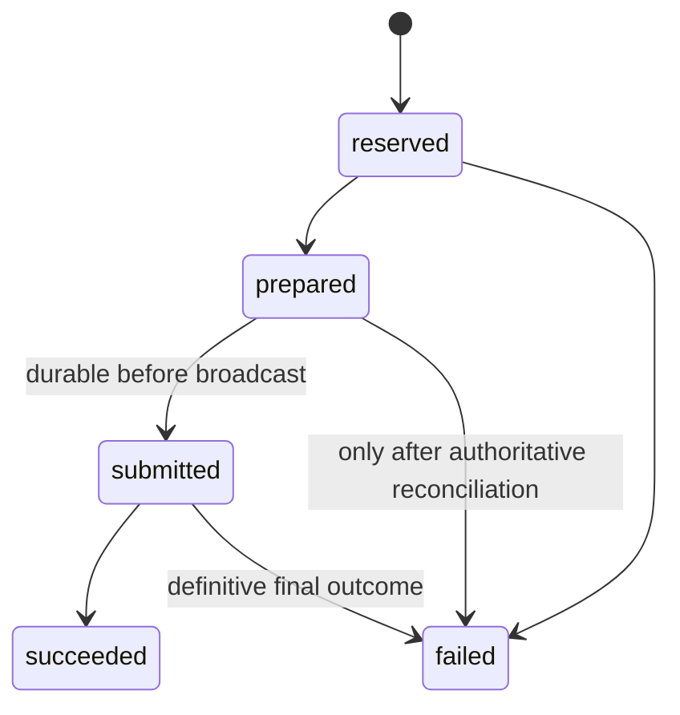

# Architecture

## System context

The resource server, not the public payer, is the API-key client. It remains
responsible for binding a payment to one protected operation. The facilitator
prevents duplicate chain settlement and can deduplicate the optional
`payment-identifier`; it cannot stop a resource server from serving multiple
responses for one payment unless that server also deduplicates.

Mainnet and testnet are separate processes, Unix users, relayer keys,
PostgreSQL databases, configuration files, ports, and hostnames. They currently
share one physical host and therefore do not provide host-level high
availability.

## Components

### `x402-chain-near`

The reusable mechanism owns:

- strict base64 and Borsh decoding with no trailing bytes;
- classic NEP-366 signature verification through NEAR's domain-separated
  implementation;
- exact delegate-action structure and NEP-141 argument validation;
- block-pinned final state queries for account, access key, code, balance, and
  recipient storage;
- outer Transaction V0 construction and signing;
- final transaction lookup and inner receipt-graph validation.

It has no HTTP authentication, tenant policy, PostgreSQL schema, deployment,
or Honeycomb dependency.

### Service boundary

The service owns:

- canonical x402 `/supported`, `/verify`, and `/settle` response shapes;
- content-type and 64 KiB body enforcement;
- API-key authentication and exact policy lookup;
- per-key request limits and sponsorship budgets;
- durable idempotency and settlement state;
- active-instance leadership and startup reconciliation;
- secret redaction, request IDs, and OTLP export;
- health and sanitized readiness.

Expected payment rejection remains an HTTP 200 protocol result. Malformed
transport, authentication, policy quota, identifier conflict, and unavailable
infrastructure are HTTP errors.

### Administration boundary

`x402-near-admin` uses explicit database or configuration inputs to apply
migrations, manage API clients and exact payee policies, rotate or revoke
credentials, set budgets, and start an operator-directed reconciliation.
It is not exposed over HTTP. Migration credentials are never supplied to the
service process.

## Verify flow

1. Nginx accepts only JSON bodies no larger than 64 KiB and forwards a request
   ID without logging authentication headers or bodies.
2. The service authenticates `X-API-Key`, Bearer, or identical values in both
   forms, then applies the key's verify rate limit. Non-identical dual
   credentials are rejected.
3. It validates x402 v2, `exact`, the pinned network, configured Circle asset,
   minimum amount, and the client's exact payee policy.
4. The mechanism decodes and verifies the signed delegate before trusting the
   payer identity.
5. It obtains one final block and pins account, access-key, code, token balance,
   and recipient-storage checks to that block where supported.
6. A valid or invalid x402 response is returned. No relayer nonce is consumed
   and no transaction is broadcast.

Verification is a current-state preflight, not a reservation. Settlement
repeats it because the payer's nonce, balance, or storage can change.

## Settle flow

1. Authenticate, enforce policy, derive the global delegate hash, validate the
   optional payment identifier, and begin one PostgreSQL transaction.
2. Claim the delegate, persist the normalized request and policy snapshot, and
   reserve the conservative sponsorship amount atomically.
3. Acquire active-instance leadership and the in-process relayer mutex.
4. Reverify against final chain state.
5. Read the relayer access-key nonce at finality and construct exactly one
   outer transaction.
6. Persist the relayer key identity, nonce, exact signed bytes, and transaction
   hash as `prepared` before submission.
7. Mark the journal `submitted` durably, recheck leadership, and only then
   submit the already stored bytes. This ordering covers a broadcast that the
   RPC accepts before the process loses its response.
8. Wait for `FINAL`, bind the returned transaction identity to the exact
   stored hash, relayer, and payer, then walk the receipt graph:
   transaction → payer delegate receipt → exactly one configured token receipt.
9. Return success only when that token receipt is `SuccessValue`; persist the
   exact terminal response and reconcile reserved sponsorship to actual cost.

Concurrent calls for the same payment join or return the recorded result. A
different identifier cannot make a delegate payable twice.

## Journal and recovery

The source of truth is PostgreSQL. The minimum logical records are:

| Record | Purpose |
| --- | --- |
| API client | Public identifier/prefix, HMAC digest, status, rate and sponsorship policy |
| Payee policy | Exact client, network, asset, and `pay_to` tuple |
| Settlement | Global delegate hash, identifier/fingerprint, policy snapshot, lifecycle, exact outer transaction, terminal response |
| Daily sponsorship ledger | Atomic reservation and actual sponsored cost by environment/client/day |

Settlement states are monotonic:

Nonterminal rows are never expired by retention jobs. On startup, the process
holds a session advisory lock and keeps readiness false while reconciling:

- stale `reserved` rows without an outer transaction can release their budget;
- `prepared` and `submitted` hashes are queried on primary, then backup RPC;
- a final result is terminal only when it matches the stored transaction
  identity and proves either the unique inner token receipt succeeded or a
  typed on-chain execution failed;
- pending, missing, structurally inconsistent, identity-mismatched, or
  RPC-ambiguous evidence is indeterminate: the row remains nonterminal,
  readiness stays false, and callers receive a retryable 503 rather than a
  guessed x402 result;
- when both RPCs report the hash unknown and both relayer nonces are unchanged,
  an expired delegate becomes a definitive failed result and is never
  rebroadcast;
- while the delegate remains valid, exact stored bytes may be rebroadcast only
  after both providers' nonce and final-block checks, never by signing a new
  transaction;
- a consumed relayer nonce with no known stored transaction quarantines the
  key and keeps readiness false.

## Operational topology

Nginx terminates public TLS and routes:

- `x402.mikedotexe.com` to `127.0.0.1:8402`;
- `test.x402.mikedotexe.com` to `127.0.0.1:8403`.

Route 53 records point both names directly at the host; no CDN or proxy tier
fronts the origin. One publicly trusted certificate covers exactly these
names, deny-by-default virtual hosts refuse unknown Host and SNI values, and
the API-key boundary plus Nginx method, body-size, and timeout limits face
the public Internet directly.
Each systemd unit reads non-secret JSON from
`/etc/x402-near-facilitator/<environment>.json` and receives the database URL,
relayer credential, API-key pepper, and OTLP headers through
`LoadCredential`.

Releases are immutable version directories. The `current-mainnet` and
`current-testnet` symlinks are the only deployment pointers, so each
environment can be promoted or rolled back without changing the other.
Database migrations remain forward-only and compatible with the previous
binary.
